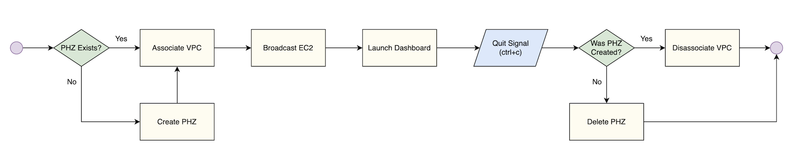

# Auto Attachment of your EC2

Your EC2 can automatically be attached to a default Route53 Private Hosted Zone (PHZ) called `dns53`.

```sh
dns53 --auto-attach
```

For this to work as intended, `dns53` handles two attachment scenarios, removing the need for any PHZ management. 👍

## You are the first Auto Attachment

Congratulations, you beat everyone else in your team or organisation and auto-attached your EC2 to the default `dns53` PHZ. `dns53` will:

1. Create the new `dns53` PHZ and associate the launched EC2 VPC with it.
1. Broadcasts your EC2 as expected, using a custom domain name if provided.
1. Tidies everything up when you exit.

## Auto Attachment has already happened

If someone in your team, or organisation, was super keen and already auto-attached their EC2 to the default `dns53` PHZ, your attachment will be slightly different. `dns53` will:

1. Check if your launched EC2 is within a VPC associated with the PHZ. If not, it will create a new association.
1. Broadcasts your EC2 as expected, using a custom domain name if provided.
1. Tidies everything up when you exit.

## A 10,000-foot view


